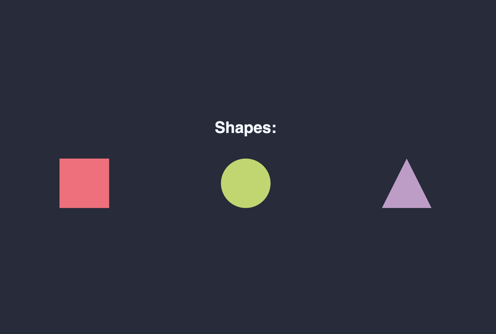
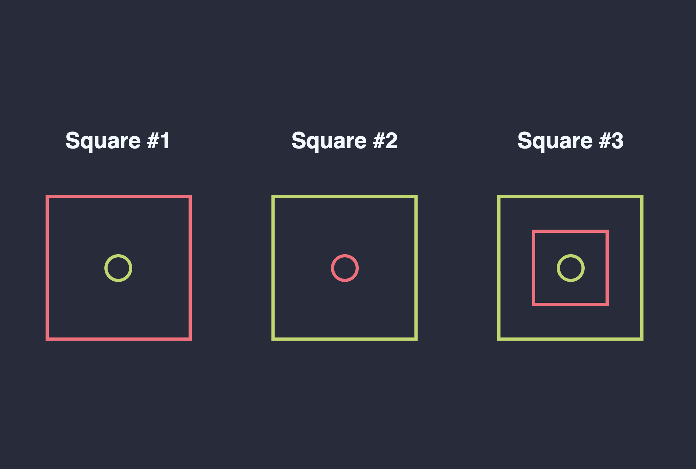
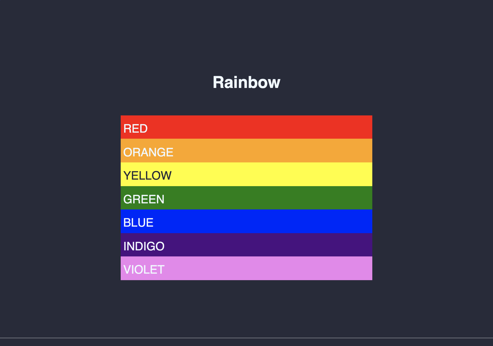

Selectors can be painful. Especially when you are starting with test automation. During my recent Cypress workshop, I saw some people struggle with selectors and the reason was, that they were using a different approach for selecting elements on page. In this blog, I would like to showcase some basics on how to select elements on page using Cypress.

If you want to follow along this article, [there’s a repo on my GitHub page](https://github.com/filiphric/cypress-selectors) where you’ll find all the examples.

## Selecting a single element
In Cypress, you select elements using this syntax:

```js
cy.get('.selector')
```

For starters, let’s look into what goes into the `.selector` part. Cypress is selecting elements by [querying DOM](https://www.w3schools.com/cssref/css_selectors.asp). You may be already familiar with such selectors if you have ever played with CSS or used jQuery or if you are familiar with `document.querySelector` command in JavaScript. Let’s see  what does this mean. As an example we can look into a page that looks something like this:

To select elements, it is of course vital to see into the page. Markup of our page looks like this:
```html
<h1>Shapes:</h1>
<div class="square"></div>
<div id="circle"></div>
<div shape="triangle"></div>
```
We can select an element using `h1` tag. If we want to select one of our shapes, we can select a single element using either class, id or an attribute.
```js
cy
  .get('h1') // select by tag
  .get('.square') // select by class
  .get('#circle') // select by id
  .get('[shape="triangle"]'); // select by attribute
```
To select an element by class you need to use `.` prefix and to select an element by its it, you should prefix id with `#`. The most common attribute you might find on your page would be a `placeholder` for an input or even a `test-id` where your selector starts and ends with square brackets. If choose to we select an element that is found multiple times on our page, such as our `div` element, Cypress will select all three of them. [Try it for yourself in the code!](https://github.com/filiphric/cypress-selectors)

## Selecting child elements
When working with nested elements, these are often being referred to as child elements. The logic of nesting is simple. Child is nested by a parent. Each element can be both parent or child, depending on the relationship with some other element. In this next example, we have an html page where its structure looks something like this:
```html {2}
<div class="square-big red">
  <div class="circle green"></div>
</div>

<div class="square-big green">
  <div class="circle red"></div>
</div>

<div class="square-big green">
  <div class="square-small red">
    <div class="circle green"></div>
  </div>
</div>
```
The structure is pretty simple and hopefully readable. All the green elements have a class `.green` on them, and all the circle elements have a class `.circle` on them. On the line 2, we have an element that has both of these classes. This will render a green circle. I made a screenshot of the actual page. Give yourself a moment and try to see how the html code corresponds with the rendered page (BTW, I left out the headings in the html code):



Let’s focus only the inner circles for now. Selecting our circle by class, using `cy.get('.circle')` would return all 3 elements. But we may want to narrow down our selection though. We can do that by specifying our selector. Which element(s) would you guess will be returned by this selector?
```js
cy
  .get('.green .circle')
```
The correct answer is circles in square #2 and square #3. This selector will look for all `.circle` elements, that are inside any `.green` element. As we can see on our page, both of these are nested in a `.green` element, our big green square.

Now let’s say we want to select only the circle inside square #2. In other words, if the circle is inside a red square, we want to ignore it. In our case, we would do it like this:
```js
cy
  .get('.green > .circle');

```
This selector will only select those `.circle` elements, where a `.green` element is one level above. Since in square #3, our `.circle` element is nested inside a `.red` element, it will not be selected.

There are tons of ways we can select elements, and `.get()` command works well with most of them. (I say most of them, since it is not possible to use pseudo selectors, such as `:hover` or `:visited` etc.) You can find a whole variety of selectors on [W3 schools page](https://www.w3schools.com/cssref/css_selectors.asp). Mastering these will help you immensely with writing your tests and understanding DOM structure of your page.

## Cypress commands for selecting elements
While mastering various CSS selectors is definitely useful, there are ton of ways you can select elements on page using Cypress commands. More importantly, these commands provide a better readability to for tests. In this example, we will be testing this lovely rainbow page:


## Select by text
To select our element its containing text we can use `.contains()` command. This is very [similar to a jQuery method with the same name](https://api.jquery.com/jQuery.contains/#jQuery-contains-container-contained). This command can be used in various ways:
```js
// select an element with the text "indigo"
cy
  .contains('indigo')

// select an h1 element, that contains the text "Rainbow"
cy
  .contains('h1', 'Rainbow')
```
You can even chain your commands together and create what is in my opinion quite self-explanatory code. Following code will look for a `li` (list item) element inside our `.list`. It will find multiple elements and from these, we will find the one that has the text "purple" inside it.
```js
cy
  .get('.list')
  .find('li') // returns 7 li elements
  .contains('violet') // returns a single element
```

## Select by position in list
Inside our list, we can select elements based on their position in the list, using `.first()`, `.last()` or `.eq()` selector.
```js
cy
  .get('li')
  .first(); // select "red"

cy
  .get('li')
  .last(); // select "violet"

cy
  .get('li')
  .eq(2); // select "yellow"
```
You can also select an element relative to a selected element. For example, we can select a `.blue` element by using `.next()` command like this:
```js
cy
  .get('.green')
  .next(); // will select the element .blue
```
And of course, you can go the other way around:
```js
cy
  .get('.green')
  .prev(); // will select the element .yellow
```

## Select elements by filtering
Once you select multiple elements (e.g. by `.get('li')` command, which returns 7 elements), you can filter within these  based on another selector. Following code will only select the colors red, green and blue, since these are primary colors and have a class `.primary` on them.
```js
cy
  .get('li')
  .filter('.primary') // select all elements with the class .primary
```
To do the exact opposite, you can use `.not()` command. With this command you will select all the colors except red green and blue.
```js
cy
  .get('li')
  .not('.primary') // select all elements without the class .primary
```
## Finding elements
You can specify your selector by first selecting an element you want to search within, and then look down the DOM structure to find a specific element you are looking for.
```js
cy
  .get('.list')
  .find('.violet') // finds an element with class .violet inside .list element
```
Instead of looking down the DOM structure and finding an element within another element, we can look up. In this example, we first select our list item, and then try to find an element with a `.list` class
```js
cy
  .get('.violet')
  .parent('.list') // finds an element with class .list that is above our .violet element
```
## Going further
You can combine these commands any way you want to get to your element. However, you don’t want to overdo it. The cleanest way to select elements in Cypress is to make sure that your application actually contains the selectors you need. It is a good practice to add your own `data-test` attributes to those elements in your app, that you want to interact with. Moreover, if you then use the[Cypress Selector playground](https://docs.cypress.io/guides/core-concepts/test-runner.html#Selector-Playground), you may find your selectors more easily. This is because Cypress favors these selectors over classes, ids or other attributes. But you can easily customize which selectors should the Selector Playground utility prefer.

If you are already using attributes to mark your elements, here’s a tip for you. You can create a custom command, that will select your element by e.g. `data-cy` attribute:
```js
Cypress.Commands.add('getById', (input) => {

  cy
    .get(`[data-cy=${input}]`)

})
```
which you can later use in your test like this:
```js
cy
  .getById('indigo')
```
Selecting your elements can definitely be a painful task when you are starting and don’t know what’s what. I hope this guide will help you navigate through your application DOM. If you are a PRO already, share the link with your friend. They might still be struggling 😅